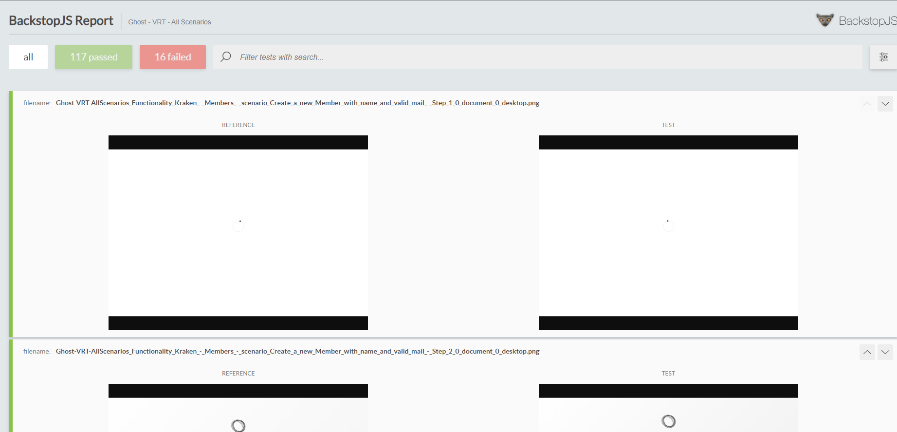

## Descripción de implementación de BackStop

Este repositorio contiene scripts y configuraciones para realizar pruebas de regresión visual automatizadas utilizando BackstopJS. A continuación, se describe detalladamente cómo configurar, ejecutar y mantener estas pruebas.

### Instalación Global de BackstopJS

Primero, instala BackstopJS globalmente para acceder a los comandos desde cualquier ubicación:

```bash
npm install -g backstopjs
```

### Configuración del Proyecto

Se inicializo un proyecto de node, mediante el comando de ``npm init -y`, el cual se utiliza en este reporte paral a generación de script y la ejecución de las pruebas de regresión visual (VRT)

Por otro lado se hace la instalación de `yargs` para poder ejecutar script con parámetros

```bash
npm install yargs
```

Se agregan los scripts que nos permite generar una configuración del proyecto de una manera mas facil y rapida para ejecutar las pruebas con backstop, los script son:

```json
"scripts": {
  "create:0.1": "node ./createbackstop.js --misMatchThreshold=0.1 --unique=true",
  "create:0.5": "node ./createbackstop.js --misMatchThreshold=0.5 --unique=true",
  "create:1": "node ./createbackstop.js --misMatchThreshold=1 --unique=true",
  "create:5": "node ./createbackstop.js --misMatchThreshold=5 --unique=true",
  "create:10": "node ./createbackstop.js --misMatchThreshold=10 --unique=true",
  "create:25": "node ./createbackstop.js --misMatchThreshold=25 --unique=true",
  "create:50": "node ./createbackstop.js --misMatchThreshold=50 --unique=true",
  "test:scenary:all": "node ./runBackStop.js"
}
```

> `create:X` nos permite la creación de archivos de configuración con un umbral distinto para la aprobación de las prebas

> `test:scenary:all` nos permite la ejecución de todas las pruebas de regresión visual (VRT) que se encuentran en el archivo json `scenarios.json`, al finalizar todo el script se genera un reporte en html con los resultados de las pruebas ubicado en la carpeta `backstop-report` este se compone de una serie de archivos (htmls - js - imagenes) que contiene lainformación de cada una de las pruebas ejecutadas

Por lo tanto, ejecute, `npm run create:10` para crear pruebasque tengan scenarios con un humbral de diferencia del 10% para pasar las pruebas, luego ejecute `test:scenary:all` y espere a que termine, esto abrira un archivo html que contendrá el reporte de las pruebas realizadas.


### Ejemplo de ejecución de pruebas con umbral de diferencia del 10%


```bash
npm run create:10
```
 > espere a que el script finalice


```bash
npm run test:scenary:all
```
 > espere a que el script finalice y abra el reporte, puede presentar bloqueos del navegador mientras se implementa

## Scenarios

Archivo scenarios.json
Este archivo contiene datos de escenarios para las pruebas de regresión visual, en este se importan cada uno de los screnshots tomados por las herramientas de kraken y playwright durante la ejecución de pruebas E2E y que hacen referencia a una version estable `4.38.0`, cada escenario tiene la siguiente estructura:

```json
  {
    "funtionality": "Kraken - Members",
    "scenary": "Create a new Member with name and valid mail",
    "url": "../kraken-ghost-4-48.9/screenshots/members/create_a_new_member_with_name_and_valid_mail",
    "referenceUrl": "../kraken-ghost-4-38.0/screenshots/members/create_a_new_member_with_name_and_valid_mail"
  }
```

> `funtionality` hace referencia a la funcionalidad que se esta probando
> `scenary` hace referencia a la prueba que se esta realizando
> `url` hace referencia a la ruta de los screenshots de la version `4.48.9` (Nueva Version o versión de prueba)
> `referenceUrl` hace referencia a la ruta de los screenshots de la version `4.38.0` (Version actual - que pasaron las pruebas e2e)

Asi mismo puede cargar mas escenarios en el archivo `scenarios.json` para que sean ejecutados en las pruebas de regresión visual (VRT), unicamente debe tener en cuenta la ubicación de las carpetas de con las imagenes de referencia y las imagenes de prueba. y que los pasos de cada prueba debe ser la misma cantidad.


## Explicación del script createbackstop.js

Este script nos permite la creación de archivos de configuración con un umbral distinto para la aprobación de las prebas, para esto se hace uso de la libreria `yargs` que nos permite la ejecución de script con parámetros, en este caso se hace uso de los siguientes parámetros:

```bash
--misMatchThreshold=0.1 --unique=true
```

> `--misMatchThreshold` nos permite definir el umbral de diferencia para la aprobación de las pruebas, en este caso se define un umbral del 10% para la aprobación de las pruebas

> `--unique` nos permite definir si se deben tomar todos los escenarios definidos en el archivo `scenarios.json` y guardarlos en el archivo de configuración de backstop llamado `backstop.json`, este es tomado por defecto para cualquier proyecto

### El archivo createbackstop.js

Este se compone de los métodos:

 - `main` el cual limpia la carpeta `backstop_data` y ejecuta el método `createBackstop` para la creación de los archivos de configuración de backstop
 - `saveBackStopConfig` este lee el archivo `scenarios.json` y genera una iteración del contenido de las carpetas declaradas por cada scenario, de esta manera obtenemos todas las imagenes tomadas por cada paso en cada una de las versiones y las vamos añadiendo a un arreglo de objetos que son la definición de la prueba, la estructura de esta se define a continuación:

```json
  {
    label: `Functionality: ${scenariosData.funtionality} - scenario: ${scenariosData.scenary} - Step: ${index + 1}`,
    url: path.join(scenariosData.url, referenceImage),
    referenceUrl: path.join(scenariosData.referenceUrl, refUrlImages[index]),
    readyEvent: '',
    delay: 1500,
    misMatchThreshold,
    readySelector: "",
    hideSelectors: [],
    removeSelectors: [],
    hoverSelector: "",
    clickSelector: "",
    postInteractionWait: 0,
    selectors: [],
    selectorExpansion: true,
    expect: 0,
    requireSameDimensions: true
  }
```
    - label: hace referencia a la descripción del paso de la prueba
    - url: hace referencia a la ruta de la imagen de prueba
    - referenceUrl: hace referencia a la ruta de la imagen de referencia que es estable
    - misMatchThreshold: hace referencia al umbral de diferencia para la aprobación de la prueba


  - Al finalizar el recorrido de cada escenario, estos se añaden al json generalm  y se identifican con el key de scenarios, asi mismo el archivo contiene otros datos de configuración que son tomados por defecto para cualquier proyecto, estos son:

```js	
    id,
    viewports: [
      {
        label: 'desktop',
        width: 800,
        height: 600
      },
    ],
    paths: {
      bitmaps_reference,
      bitmaps_test,
      engine_scripts,
      html_report,
      ci_report,
    },
    report: ['html'],
    engine: 'puppeteer',
    engineOptions: {
      headless: 'new',
      args: ['--no-sandbox'],
    },
    asyncCaptureLimit: 5,
    asyncCompareLimit: 50,
    debug: false,
    debugWindow: false,
  }
```	

 > `id` hace referencia al nombre de la prueba - es el titulo del reporte
 > `viewports` hace referencia a los tamaños de pantalla en los que se ejecutaran las pruebas
 > `paths` hace referencia a las rutas de las carpetas donde se guardaran los resultados de las pruebas, imágenes de referencia, imágenes de prueba y scripts de ejecución
 > `report` hace referencia al tipo de reporte que se generara al finalizar la ejecución de las pruebas
 > `engine` hace referencia al motor de ejecución de las pruebas, en este caso se hace uso de puppeteer
 > `engineOptions` hace referencia a las opciones de ejecución del motor de pruebas, en este caso se hace uso de puppeteer


### El archivo runBackStop.js

Este archivo nos permite la ejecución de todas las pruebas de regresión visual (VRT) que se encuentran en el archivo json `scenarios.json`, al finalizar todo el script se genera un reporte en html con los resultados de las pruebas ubicado en la carpeta `backstop-report` en la raiz de este proyecto, este se compone de una serie de archivos (htmls - js - imagenes) que contiene la información de cada una de las pruebas ejecutadas


El código de este archivo tiene dos funciones principales: updateFiles y runOperation. los parametros que se le pasa a este script son: 

 - config: El nombre del archivo de configuración.
 - report: El tipo de reporte.

El método runOperation ejecuta un comando de BackstopJS el cual recibe dos parametros:
  - config: El nombre del archivo de configuración.
  - operation: La operación a ejecutar. (test - approve)


La ejecución de este script se realiza de la siguiente manera:
  - Ejecuta las pruebas con el comando 'backstop test'.
  - Actualiza las pruebas con la función updateFiles.
  - Aprueba las pruebas con el comando 'backstop approve'.
  - Genera un informe con el comando 'backstop test'.
  - Limpia las pruebas con la función updateFiles para el navegado

 > El proceso de ejecución dep ruebas puede llegar hacer demorado, por lo que debe tener pacienciamientras se ejecuta todas las operaciones, adicionamlmente puede presentar bloqeos en el navegador durante este proceso, por eso, mientras ejecute el script no realice ninguna operación y espere a que este finalice

Al finalizar la operación de este script al usuario se le deberia abrir un reporte html en algun navegador.


### Publicación del reporte

Al tener un nuevo reporte generado por el script `runBackStop.js` se debe actualizar la carpeta `backstop-report` en la raiz de este proyect con un nuevo html, si desea poder desplegar el reporte en una pagina web y está seguro de acerlo, simplemente haga push de sus cambios y espere unos minutos, debera poder ver los cambios aplicados en el enlace del reporte [REPORTE - BACKSTOP](https://misw-4103-ghost-e25-delta.vercel.app/)] 





